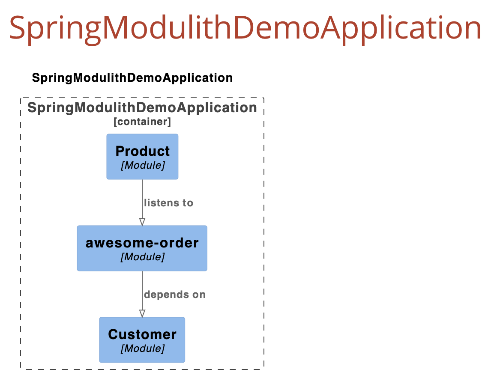

# Spring Modulith Demo

This project demonstrates **Spring Modulith** - a modular monolith architecture using Spring Boot. It showcases how to build a well-structured application with clear module boundaries, inter-module communication via Spring Events, and event externalization to Apache Kafka. Later on if needed, this one of module can be separated out into a µ-services.

## 🎯 Key Features

- **Package-based Module Separation**: Application is organized into distinct modules (`customer`, `order`, `product`)
- **Event-Driven Communication**: Modules communicate using Spring's `ApplicationEventPublisher` 
- **Kafka Event Externalization**: Internal events are published to Kafka topics using custom event publishers
- **Event Publication Tracking**: JDBC-based event publication registry automatically creates `event_publication` table to track event status
- **OAuth2/OIDC Authentication**: Secured with Keycloak for enterprise-grade authentication and authorization
- **Role-Based Access Control**: Fine-grained authorization using Keycloak realm and client roles
- **Modularity Verification**: Unit tests verify module structure and dependencies
- **Auto-generated Documentation**: PlantUML diagrams and module documentation generated from code

## 📦 Project Structure


```
spring-modulith-demo/
├── src/main/java/com/paxier/spring_modulith_demo/
│   ├── SpringModulithDemoApplication.java
│   ├── customer/          # Customer module (JPA)
│   │   ├── Address.java
│   │   ├── Customer.java
│   │   ├── CustomerController.java
│   │   ├── CustomerService.java
│   │   ├── CustomerRepository.java
│   │   ├── AddressRepository.java
│   │   └── package-info.java
│   ├── order/             # Order module
│   │   ├── Order.java
│   │   ├── OrderService.java
│   │   ├── OrderController.java
│   │   ├── OrderPlaceEvent.java # Externalized event for kafka
│   │   ├── OrderRepository.java
│   │   └── LineItem.java
│   │   └── package-info.java
|   |
│   └── product/           # Product module
│       └── ProductsService.java
│   │   └── package-info.java
└── src/test/java/
    ├── ModularityTests.java   # Module structure verification
    └── customer/
        ├── CustomerIntegrationTest.java
        ├── CustomerServiceTest.java
        └── CustomerControllerTest.java
```

## 🏗️ Architecture

### Module Dependencies Diagram



### Modules Overview

#### 1. Customer Module (JPA-based)
- **Technology**: Spring Data JPA with separate tables
- **Entities**: `Customer` (customers table) and `Address` (addresses table)
- **Relationship**: OneToOne with cascade operations
- **Endpoints**:
  - `POST /customers` - Create customer with address
  - `GET /customers` - Get all customers
  - `GET /customers/{id}` - Get customer by ID
- **Testing**: Full integration tests with H2 database

#### 2. Order Module (Spring Data JDBC)
- **Technology**: Spring Data JDBC with event externalization
- **Communication**: Publishes `OrderPlaceEvent` to Kafka
- **Event Tracking**: Uses `event_publication` table

#### 3. Product Module
- **Service Layer**: Business logic for products

### Module Communication Flow

1. **Order Creation**: `OrderController` receives HTTP POST request
2. **Internal Event**: `OrderService` publishes `OrderPlaceEvent` using `ApplicationEventPublisher`
3. **Kafka Publishing**: Annotation `@Externalized` automatically send event to topic `order-created`
4. **Event Tracking**: Spring Modulith JDBC stores spring publisher event status in `event_publication` table

### Event Publication Table

Spring Modulith automatically creates the `event_publication` table to track event publishing status:

```sql
CREATE TABLE event_publication (
    id UUID PRIMARY KEY,
    event_type VARCHAR(255),
    listener_id VARCHAR(255),
    publication_date TIMESTAMP,
    serialized_event TEXT,
    completion_date TIMESTAMP
);
```

This enables:
- **Reliability**: Failed events can be republished on restart
- **Observability**: Track which events were published successfully
- **Transactional Outbox Pattern**: Events are stored in the same transaction as business data

## 🚀 Getting Started

### Prerequisites

- Java 21
- Maven 3.6+
- Docker & Docker Compose

### Running the Application

1. **Start Infrastructure** (PostgreSQL + Kafka + Keycloak):
   ```bash
   docker compose up -d
   ```

   This will start:
   - PostgreSQL on `localhost:5432`
   - Kafka on `localhost:9092`
   - Keycloak on `localhost:8180`

2. **Configure Keycloak** (First-time setup):
   
   Follow the detailed setup guide in [KEYCLOAK_SETUP.md](KEYCLOAK_SETUP.md) to:
   - Create the `spring-modulith` realm
   - Configure OAuth2 client
   - Create test users and roles
   - Get access tokens

   **Quick Setup**:
   - Access Keycloak Admin Console: http://localhost:8180 (admin/admin)
   - Create realm: `spring-modulith`
   - Create client: `spring-modulith-client`
   - Create user: `testuser` / `password`
   - Assign roles: `user`, `admin`

3. **Run the Application**:
   ```bash
   mvn spring-boot:run
   ```

   The application will:
   - Start on `http://localhost:8080`
   - Auto-create the `event_publication` table
   - Connect to Kafka at `localhost:9092`
   - Validate JWT tokens from Keycloak

4. **Get Access Token**:
   ```bash
   TOKEN=$(curl -X POST http://localhost:8180/realms/spring-modulith/protocol/openid-connect/token \
     -H "Content-Type: application/x-www-form-urlencoded" \
     -d "client_id=spring-modulith-client" \
     -d "client_secret=YOUR_CLIENT_SECRET" \
     -d "username=testuser" \
     -d "password=password" \
     -d "grant_type=password" | jq -r '.access_token')
   ```

5. **Create an Order** (Protected Endpoint):
   ```bash
   curl -X POST http://localhost:8080/orders \
     -H "Authorization: Bearer $TOKEN" \
     -H "Content-Type: application/json" \
     -d '{
       "orderId": 1,
       "lineItems": [
         {"id": 1, "product": 101, "quantity": 2}
       ]
     }'
   ```

6. **Create a Customer with Address** (Protected Endpoint):
   ```bash
   curl -X POST http://localhost:8080/customers \
     -H "Authorization: Bearer $TOKEN" \
     -H "Content-Type: application/json" \
     -d '{
       "name": "John Doe",
       "address": {
         "street": "123 Main Street",
         "city": "New York",
         "zipCode": "10001"
       }
     }'
   ```
   
   This demonstrates **JPA's OneToOne relationship** - Customer and Address are saved in separate tables but linked via foreign key.

5. **Get All Customers**:
   ```bash
   curl http://localhost:8080/customers
   ```

6. **Verify Kafka Message**:
   ```bash
   # Enter Kafka container
   docker exec -it <kafka-container-id> bash
   
   # Consume messages from topic
   kafka-console-consumer --bootstrap-server localhost:9092 \
     --topic order-created --from-beginning
   ```

   You'll see JSON messages like:
   ```json
   {
     "orderId": 1,
     "lineItems": [
       {"id": 1, "product": 101, "quantity": 2}
     ]
   }
   ```

## 🧪 Testing

### Modularity Tests

Run tests to verify module structure:

```bash
./mvnw test
```

The `ModularityTests` class:
- **Verifies module boundaries**: Ensures modules only access allowed dependencies
- **Generates documentation**: Creates PlantUML diagrams in `target/spring-modulith-docs/`
- **Validates structure**: Fails if modules violate architectural rules

### Generated Documentation

After running tests, check `target/spring-modulith-docs/`:
- `components.puml` - Overall architecture diagram
- `module-order.puml` - Order module diagram
- `module-customer.puml` - Customer module diagram
- `module-product.puml` - Product module diagram
- `all-docs.adoc` - Complete documentation

## ⚙️ Configuration

### application.yml

```yaml
spring:
  modulith:
    events:
      republish-outstanding-events-on-restart: true  # Retry failed events
      jdbc:
        schema-initialization:
          enabled: true  # Auto-create event_publication table
  kafka:
    bootstrap-servers: localhost:9092
  security:
    oauth2:
      resourceserver:
        jwt:
          issuer-uri: http://localhost:8180/realms/spring-modulith
          jwk-set-uri: http://localhost:8180/realms/spring-modulith/protocol/openid-connect/certs
```

### Public Endpoints

The following endpoints don't require authentication:
- `/actuator/**` - Actuator endpoints
- `/apidoc/**` - Swagger UI
- `/v3/api-docs/**` - OpenAPI documentation
- `/swagger-ui/**` - Swagger UI resources

All other endpoints require a valid JWT token from Keycloak.

## 🔐 Security & Authentication

This application uses **OAuth2/OIDC** with Keycloak for authentication and authorization.

### Authentication Flow

1. **User logs in** to Keycloak (or gets token programmatically)
2. **Keycloak issues JWT token** with user information and roles
3. **Client sends token** in `Authorization: Bearer <token>` header
4. **Spring validates token** against Keycloak's public keys
5. **Roles are extracted** from token claims (realm_access, resource_access)
6. **Access granted/denied** based on user's roles

### Role-Based Authorization

You can secure methods using `@PreAuthorize`:

```java
@PreAuthorize("hasRole('admin')")
public void deleteOrder(int orderId) {
    // Only admins can delete
}

@PreAuthorize("hasAnyRole('user', 'customer')")
public Order getOrder(int orderId) {
    // Users and customers can view
}
```

### Keycloak Setup

See [KEYCLOAK_SETUP.md](KEYCLOAK_SETUP.md) for detailed instructions on:
- Creating realm and client
- Managing users and roles
- Getting access tokens
- Testing with curl/Postman

## 📚 Spring Modulith Concepts

### 1. Module Definition
Each top-level package under the main package is a module:
- `com.paxier.spring_modulith_demo.customer` → Customer module
- `com.paxier.spring_modulith_demo.order` → Order module
- `com.paxier.spring_modulith_demo.product` → Product module

### 2. Module Communication
Modules communicate via **Spring Application Events**:
```java
// Publishing module
publisher.publishEvent(new OrderPlaceEvent(orderId, lineItems));

// Subscribing module
@ApplicationModuleListener
void onOrderPlaced(OrderPlaceEvent event) {
    // Handle event
}
```

### 4. Event Publication Registry
The `event_publication` table tracks:
- **Pending events**: Not yet published to external systems
- **Completed events**: Successfully published
- **Failed events**: Can be republished on restart

## 🔍 Verification

### Modulith Observability

Spring Modulith provides Actuator endpoints to view the application module structure and metadata:

**View Module Structure**:
```bash
curl http://localhost:8080/actuator/modulith
```

This endpoint shows:
- Module boundaries and relationships
- Module dependencies
- Event listeners and publishers
- Externalized events configuration
- 
### Check Event Publication Table

```sql
SELECT * FROM event_publication;
```

### View Kafka Topics

```bash
docker exec -it <kafka-container-id> kafka-topics \
  --list --bootstrap-server localhost:9092
```

### Monitor Kafka Messages

```bash
docker exec -it <kafka-container-id> kafka-console-consumer \
  --bootstrap-server localhost:9092 \
  --topic order-created \
  --from-beginning
```

## 🛠️ Technology Stack

- **Spring Boot 3.5.7**
- **Spring Modulith 1.4.3**
- **Spring Security 6.x** with OAuth2 Resource Server
- **Keycloak 26.0.7** for Authentication & Authorization
- **Spring Data JDBC** & **Spring Data JPA**
- **Spring Kafka**
- **PostgreSQL**
- **Apache Kafka 7.6.1**
- **Java 21**

## 📖 References

- [Spring Modulith Documentation](https://spring.io/projects/spring-modulith)
- [Spring Modulith Reference Guide](https://docs.spring.io/spring-modulith/reference/)
- [Modular Monolith Pattern](https://www.kamilgrzybek.com/blog/posts/modular-monolith-primer)

## 📝 License

This is a demo project for learning purposes.
